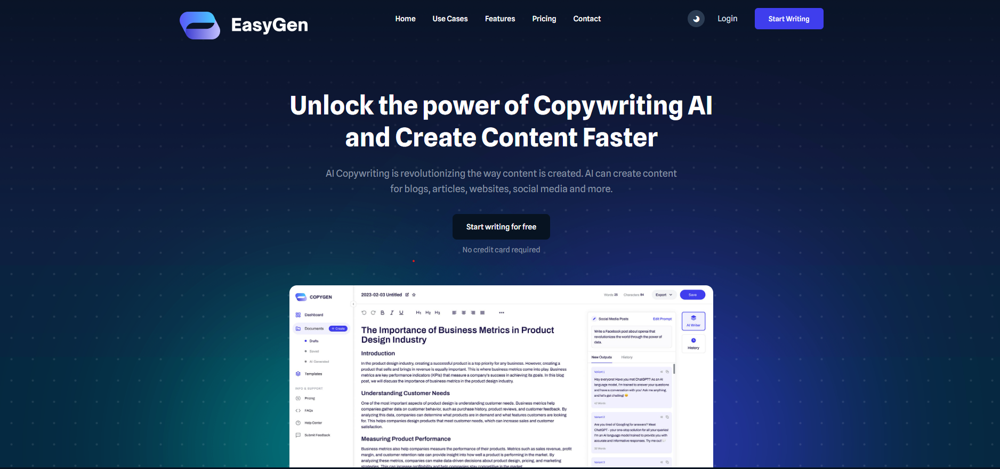
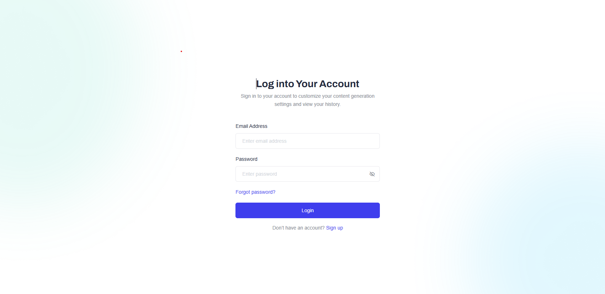
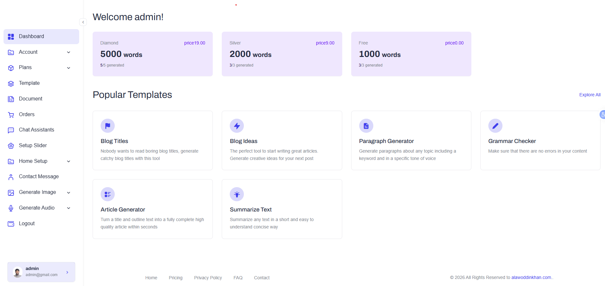
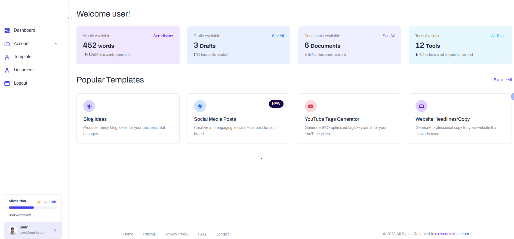
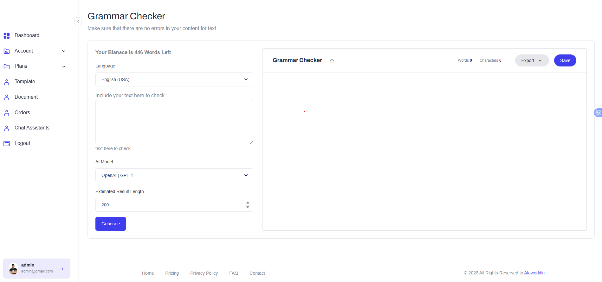
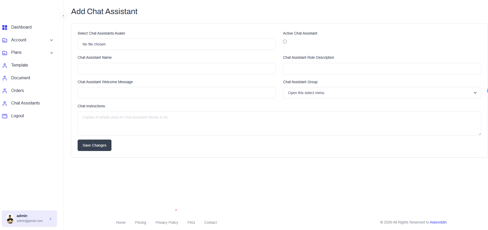

# AI Content Generator (SaaS)
AI SaaS Content Platform
Overview

AI SaaS Content Platform is a full-stack web application built with Laravel and MySQL that allows users to generate AI-powered content through an intuitive dashboard.

The platform includes both user and admin dashboards, enabling scalable content generation, user management, and AI assistant configuration.

This project demonstrates real-world SaaS architecture with authentication, role-based access, and API integration.

## Overview
...

the saas web application is create for the user have mutiple choose that select with category chatgpt use

## Features
Admin Dashboard
👥 User management system
🤖 Manage AI chat assistants
🤖 AI image Generation (OpenAI API)
🤖 AI autio Generation (OpenAI API)
⚙️ Configure system settings
📈 Monitor user activity
🗂 Content management overview

User Dashboard
🔐 Secure Authentication (Login/Register)
🤖 AI Content Generation (OpenAI API)
🤖 AI image Generation (OpenAI API)
🤖 AI autio Generation (OpenAI API)
📝 Generate blogs, articles, and text content
📂 Save and manage generated content
📊 User-friendly dashboard interface

Core System Features
Role-Based Access Control (Admin / User)
RESTful API architecture
Scalable SaaS structure
Clean and maintainable codebase

## Tech Stack
Backend: Laravel (PHP)
Frontend: Blade / (or React if applicable)
Database: MySQL
API Integration: OpenAI API
Authentication: Laravel Auth
Version Control: Git & GitHub

## Screenshots

User Dashboard

🔹 AI Content Generator

🔹 Chat Assistants Management

🔹 Image Generate 

🔹 Audio Generate 

## Live Demo
[...](https://saas-project.khedmat.website/)

## Installed Packages

The following Laravel packages are used in this project:

📄 barryvdh/laravel-dompdf — Generate PDF reports
🖼 intervention/image — Image processing and manipulation
🤖 openai-php/laravel — OpenAI API integration

## Install Dependencies

Run the following commands:

composer require barryvdh/laravel-dompdf
composer require intervention/image
composer require openai-php/laravel

##  Installation

1️⃣ Clone the repository
git clone https://github.com/alawoddin/ai-content.git
cd ai-content
2️⃣ Install dependencies
composer install
npm install
3️⃣ Setup environment
cp .env.example .env
php artisan key:generate
4️⃣ Configure database

Update your .env file:

DB_DATABASE=your_database
DB_USERNAME=root
DB_PASSWORD=
5️⃣ Run migrations
php artisan migrate
6️⃣ Start development server
php artisan serve
npm run dev

## Environment Variables

Add your OpenAI API key:

OPENAI_API_KEY=your_api_key_here